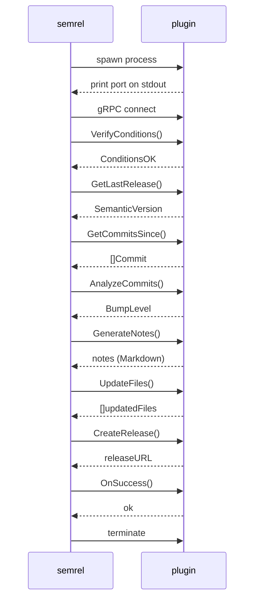

import { Card, CardGrid, Aside } from '@astrojs/starlight/components';

semrel's release pipeline is entirely composed of plugins. Every capability — from fetching commits to sending Slack notifications — is provided by a plugin process that communicates with semrel over a local gRPC connection.

## How plugins work

1. semrel starts each plugin as a **child process** from your `.semrel/` directory.
2. [hashicorp/go-plugin](https://github.com/hashicorp/go-plugin) performs a handshake over the plugin's **stdout** — the plugin binary must never write anything else to stdout.
3. All plugin logs must go to **stderr** (via `hclog` in Go).
4. semrel connects over the negotiated gRPC socket and calls the appropriate RPCs in pipeline order.
5. After the pipeline completes, semrel terminates all plugin processes.

## Plugin types

The pipeline defines six plugin interfaces. A single binary can implement one or more of them.

<CardGrid>
  <Card title="Provider Plugin" icon="github">
    Abstracts VCS platform operations: fetching the last release, listing commits since a ref, creating tags/releases, and uploading release assets.
  </Card>
  <Card title="CI Condition Plugin" icon="approve-check-circle">
    Verifies that the current environment is authorised to publish a release (e.g. running on the correct branch in a trusted CI runner).
  </Card>
  <Card title="Commit Analyzer Plugin" icon="magnifier">
    Parses the commit list and decides the required SemVer bump level: `NONE`, `PATCH`, `MINOR`, or `MAJOR`.
  </Card>
  <Card title="Changelog Generator Plugin" icon="document">
    Renders release notes from the commit list. Returns Markdown, reStructuredText, or any other format your project uses.
  </Card>
  <Card title="Files Updater Plugin" icon="pencil">
    Writes the next version string into tracked project files (`Chart.yaml`, `package.json`, `go.mod`, etc.) before the release commit is created.
  </Card>
  <Card title="Hooks Plugin" icon="warning">
    Lifecycle callbacks called after a successful release (`OnSuccess`) or when the pipeline fails (`OnFail`). Typically used for notifications.
  </Card>
</CardGrid>

## Plugin discovery

semrel looks for plugin binaries in the `.semrel/` directory at the repository root, or at the path specified by the `path` field in your config:

```yaml
plugins:
  - name: github          # loaded from .semrel/github
  - name: my-notifier
    path: ./tools/my-notifier  # explicit path
```

<Aside type="tip">
  Commit your `.semrel/` directory to version control so that your team and CI always use the same plugin versions.
</Aside>

## Plugin lifecycle



## Next steps

- [Plugin SDK — writing your first plugin](/plugins/sdk/)
- [Example plugins](/plugins/examples/)
- [gRPC API reference](/api/grpc/)
