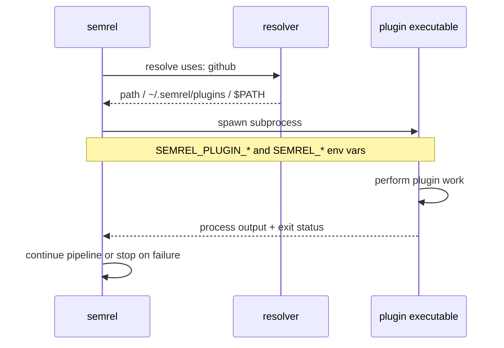

import { Card, CardGrid, Aside } from '@astrojs/starlight/components';

semrel's release pipeline is composed of standalone plugin executables. Each plugin is discovered locally and executed as a subprocess — there is no gRPC layer or RPC handshake.

## How plugins work

1. semrel reads each plugin entry from `.semrel.yaml`.
2. The `uses:` value normally resolves to a binary named `semrel-plugin-<uses>`.
3. semrel looks for that binary at an explicit `path:`, then in `~/.semrel/plugins/`, then in `$PATH`.
4. Plugin `args:` values are exposed as environment variables in the form `SEMREL_PLUGIN_<KEY>=<value>`.
5. Release context is also passed through environment variables so every plugin can read the same version, branch, tag, changelog, and dry-run state.
6. semrel runs the executable and uses the process result to continue or stop the pipeline.

## Release context environment

These environment variables are available to plugin processes during execution.

| Variable | Description |
| --- | --- |
| `SEMREL_VERSION` | The semrel CLI version |
| `SEMREL_TAG_NAME` | Full tag name for the release |
| `SEMREL_CURRENT_VERSION` | Current project version |
| `SEMREL_NEXT_VERSION` | Next version selected for the release |
| `SEMREL_BUMP` | Calculated bump level |
| `SEMREL_BRANCH` | Current git branch |
| `SEMREL_TAG_PREFIX` | Configured tag prefix |
| `SEMREL_CHANGELOG` | Generated changelog content |
| `SEMREL_DRY_RUN` | Whether the current run is a dry run |

## Plugin types

The current official plugin catalog is organized into six categories.

<CardGrid>
  <Card title="Provider Plugin" icon="github">
    Handles forge and git operations such as reading release history, creating tags, and publishing releases.
  </Card>
  <Card title="Condition Plugin" icon="approve-check-circle">
    Verifies that the current environment is allowed to publish a release.
  </Card>
  <Card title="Analyzer Plugin" icon="magnifier">
    Inspects commits and decides the SemVer bump level.
  </Card>
  <Card title="Generator Plugin">
    Produces changelogs, release notes, and other release-facing content.
  </Card>
  <Card title="Updater Plugin" icon="pencil">
    Updates versioned project files before the release is finalized.
  </Card>
  <Card title="Hook Plugin" icon="warning">
    Sends notifications or runs follow-up automation after success or failure.
  </Card>
</CardGrid>

## Plugin discovery

Discover official plugins in the [Plugin Registry](/plugins/registry/) or install them directly with `semrel plugin install <name>`.

semrel resolves plugins from the configured `uses:` value:

```yaml
plugins:
  - uses: github
    name: github-release
    args:
      owner: MyOrg
      repo: my-repo

  - uses: slack-notify
    path: /usr/local/bin/semrel-plugin-slack
    args:
      webhook_url: ${{ env.SLACK_WEBHOOK }}
```

<Aside type="tip">
  `semrel plugin install github` downloads the plugin binary into `~/.semrel/plugins/`, where future runs can discover it automatically.
</Aside>

## Plugin lifecycle



## Next steps

- [Official Plugins](/plugins/)
- [Plugin Registry](/plugins/registry/) — or browse directly at [registry.semrel.io](https://registry.semrel.io)
- [Plugin Publishing Guide](/plugins/publishing/)
- [Plugin SDK — writing your first plugin](/plugins/sdk/)